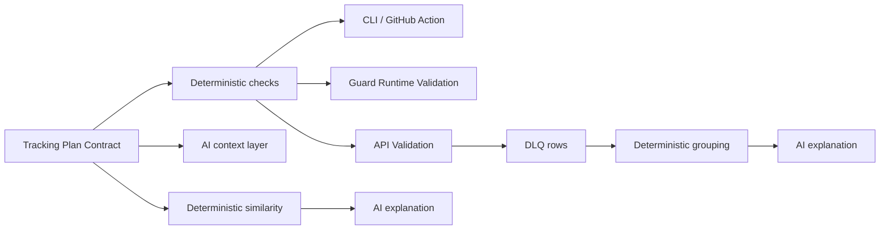

# Trackboard Semantic Consistency Checker And AI DLQ Triage Plan

Date: 2026-06-28
Status: implementation plan
Owner: Trackboard

## Product Thesis

Trackboard should use AI where ambiguity is expensive for humans, while keeping enforcement deterministic.

The two next features should extend the existing contract-first architecture:

1. **Semantic Consistency Checker**
   - Prevent duplicate or near-duplicate analytics events before they enter the tracking plan.
   - Example: warn when `order_completed` looks like an existing `CheckoutCompleted` event.

2. **AI DLQ Triage**
   - Turn recurring validation failures into human-readable incident summaries.
   - Example: explain that iOS 3.14.0 started sending `tier: "premium"` while the contract expects integer enum values.

These are not runtime AI features. Runtime validation remains deterministic in Trackboard Guard and the API validation engine.

## Existing Baseline

Current relevant code:

- `apps/api/app/services/ai_service.py`
  - Has `generate_schema_from_json`.
  - Has `analyze_schema_duplicates`, but it is too LLM-only and should be replaced with deterministic candidate scoring plus optional AI explanation.
- `apps/api/app/services/validation_service.py`
  - Writes `ValidationLog`.
  - Upserts `InvalidPayloadError` for `block` and `quarantine` invalid payloads.
- `apps/api/app/api/dlq.py`
  - Exposes `GET /plans/{plan_id}/dlq`.
  - Returns flat invalid payload rows only.
- `apps/api/app/models/__init__.py`
  - `EventSchema`, `Property`, `GlobalProperty`, `Version`, `ValidationLog`, and `InvalidPayloadError` already contain the data required for v0.
- `apps/web/src/app/(dashboard)/plans/[planId]/observability/page.tsx`
  - Shows current DLQ rows and top validation stats.
- `apps/mcp`
  - Local read-only MCP server over exported contracts.
- `apps/cli`
  - Contract parsing, validation, diff, and codegen already exist.

Important current limitation:

- The web/API DLQ and Guard SQLite DLQ are separate surfaces today. V0 AI triage should operate on the API `invalid_payload_errors` table. Guard DLQ triage can follow after Guard exposes/export syncs grouped DLQ issues.

## Architecture Principle



AI may explain, rank, summarize, and suggest. It must not publish contracts, mutate tracking plans, replay events, or decide runtime acceptance.

## Feature 1: Semantic Consistency Checker

### Goal

Warn users when a new or edited event appears semantically similar to an existing event in the same tracking plan.

This prevents event taxonomy drift:

- `Checkout_Success`
- `order_completed`
- `purchase_finished`

### Non-Goals

- Do not block event creation in v0.
- Do not automatically merge events.
- Do not use LLM output as the only source of similarity.
- Do not require embeddings/vector DB for v0.
- Do not compare across organizations in v0.

### User Stories

1. As an analyst creating a new event, I see likely duplicates before saving.
2. As a reviewer, I see semantic consistency warnings in a merge review.
3. As a maintainer, I can run a full-plan consistency audit and clean existing duplicates.
4. As an AI IDE user, I can ask Trackboard MCP whether an event already exists before adding instrumentation.

### Core Model

Create an internal event profile for every event:

```python
EventProfile = {
    "event_id": str,
    "event_name": str,
    "name_tokens": list[str],
    "description_tokens": list[str],
    "category": str | None,
    "status": str,
    "property_profiles": [
        {
            "name": str,
            "name_tokens": list[str],
            "type": str,
            "required": bool,
            "constraints": dict,
            "is_global": bool,
        }
    ],
    "global_properties": list[str],
    "implementation_guidance": dict | None,
}
```

Normalization rules:

- lowercase names
- split snake_case, camelCase, kebab-case, spaces
- remove low-signal words: `event`, `user`, `clicked`, `completed` only when they appear as boilerplate
- normalize common synonyms:
  - `checkout`, `purchase`, `order`
  - `signup`, `registration`, `account_created`
  - `cart`, `basket`
  - `completed`, `success`, `finished`
- preserve exact names in evidence.

### Similarity Scoring

Use deterministic scoring first. Suggested score range: 0 to 100.

Signals:

- Event name token similarity: 25
- Description/guidance token similarity: 15
- Property name Jaccard similarity: 20
- Required property overlap: 10
- Type compatibility: 10
- Constraint overlap: 5
- Category/status match: 5
- Lifecycle/source match from `implementation_guidance`: 10

Candidate labels:

- `duplicate_likely`: score >= 82
- `possibly_related`: score 65-81
- `weak_signal`: score 50-64
- ignore below 50 unless requested in audit mode

Evidence must be explicit:

```json
{
  "candidate_event": "CheckoutCompleted",
  "score": 87,
  "label": "duplicate_likely",
  "evidence": [
    {
      "kind": "name_similarity",
      "detail": "order/completed matches checkout/completed through synonym map",
      "weight": 22
    },
    {
      "kind": "property_overlap",
      "detail": "5 of 6 required properties overlap: user_id, order_id, revenue, currency, payment_method",
      "weight": 18
    }
  ],
  "recommendation": "reuse_existing_event"
}
```

### AI Usage

AI is optional and should explain deterministic candidates only.

Prompt input should include:

- proposed event profile
- top 5 deterministic candidates
- score breakdown
- selected contract guidance snippets

AI output:

```json
{
  "summary": "This new event looks like an existing checkout completion event.",
  "risk": "Creating both events may split conversion reporting by platform.",
  "recommendation": "reuse_existing_event",
  "questions": [
    "Is order_completed meant to fire after payment settlement or after button click?"
  ]
}
```

The UI must always show deterministic score/evidence next to AI text.

### Backend Design

New files:

- `apps/api/app/services/semantic_consistency.py`
  - profile builder
  - tokenizer
  - synonym map
  - score engine
  - full-plan audit
  - proposed-event comparison
- `apps/api/app/api/consistency.py`
  - API routes
- `apps/api/tests/test_semantic_consistency.py`
  - unit tests for scoring and normalization
- `apps/api/tests/test_consistency_api.py`
  - route tests

Existing file updates:

- `apps/api/app/api/router.py`
  - include consistency router
- `apps/api/app/services/ai_service.py`
  - replace `analyze_schema_duplicates` internals with `SemanticConsistencyService`
  - add `explain_consistency_candidates`
- `apps/api/app/schemas/tracking_plan.py`
  - add response/request schemas
- `apps/api/app/api/ai.py`
  - keep old `/ai/analyze` as compatibility wrapper or deprecate in docs

Suggested routes:

```text
POST /api/v1/plans/{plan_id}/consistency/preview
GET  /api/v1/plans/{plan_id}/consistency/audit
GET  /api/v1/events/{event_id}/consistency
POST /api/v1/plans/{plan_id}/ai/consistency/explain
```

`preview` request:

```json
{
  "event_name": "order_completed",
  "description": "User finished an order",
  "category": "checkout",
  "properties": [
    {"name": "order_id", "type": "string", "required": true},
    {"name": "revenue", "type": "float", "required": true}
  ],
  "implementation_guidance": {
    "trigger_when": ["payment webhook succeeds"],
    "do_not_trigger_when": ["pay button is clicked"]
  }
}
```

Response:

```json
{
  "proposed_event_name": "order_completed",
  "candidate_count": 2,
  "candidates": [
    {
      "event_id": "...",
      "event_name": "CheckoutCompleted",
      "score": 87,
      "label": "duplicate_likely",
      "recommendation": "reuse_existing_event",
      "score_breakdown": {
        "name_similarity": 22,
        "property_overlap": 18
      },
      "evidence": []
    }
  ]
}
```

### Frontend Design

Event create/edit flow:

- After event name/description/properties are entered, call `consistency.preview`.
- Debounce preview calls by 400-600 ms.
- Show a compact warning panel above Save:
  - top candidate event name
  - score label
  - overlapping properties
  - actions:
    - `View existing`
    - `Continue anyway`
    - `Rename / reuse`
    - `Ask AI to explain`

Plan-level audit page:

- Add `Consistency` section under plan detail or settings.
- Show:
  - duplicate clusters
  - affected events
  - evidence columns
  - status filters
  - exportable report

Merge review:

- Add semantic warnings for events added in a branch when compared against main.
- Do not block merge in v0.

### CLI Design

New command:

```bash
trackboard lint-consistency --contract contract.json --threshold 65
```

Output:

- machine-readable JSON with `--json`
- human summary by default
- exit code 0 in v0 unless `--strict` is set
- exit code 2 with `--strict` when `duplicate_likely` candidates exist

### MCP Design

New read-only MCP tools:

- `search_similar_events`
  - input: event name, optional properties, optional description
  - output: deterministic candidates and evidence
- `explain_event_similarity`
  - input: proposed event plus selected existing event
  - output: explanation text with evidence

MCP must remain read-only.

### Semantic Consistency Acceptance Criteria

- Creating `order_completed` next to `CheckoutCompleted` produces a `duplicate_likely` warning with score >= 82.
- Creating `ProductViewed` next to `CheckoutCompleted` produces no warning.
- Score explanation is deterministic and testable.
- AI explanation cannot appear without deterministic evidence.
- API tests pass without an AI provider configured.
- UI remains usable when AI provider is disabled.
- CLI can run against exported contracts without server access.
- MCP tools do not mutate plans.

## Feature 2: AI DLQ Triage

### Goal

Convert recurring invalid payloads into grouped, explainable incidents with remediation options.

Raw DLQ rows should become:

```text
Issue: iOS started sending subscription tier as string
Affected event: CheckoutCompleted
Count: 83
First seen: 2026-06-28 10:12
Last seen: 2026-06-28 12:03
Likely source: ios-app
Contract expects: tier integer enum [1, 2]
Payload sends: tier string "premium"
Recommended action: update client mapping or migrate contract to string enum.
```

### Non-Goals

- Do not auto-edit contracts.
- Do not auto-replay DLQ events.
- Do not send raw payloads to AI by default.
- Do not depend on AI to group failures.
- Do not claim Guard SQLite DLQ is fully integrated until a sync/export path exists.

### DLQ Grouping Model

Current `InvalidPayloadError` groups by exact `event_name` and `error_reason`. That is useful but too coarse and text-dependent.

Add deterministic fingerprints.

Fingerprint input:

- `plan_id`
- `version_id`
- `event_name`
- validation violation `code`
- violation `path`
- violation `property_name`
- expected type or enum summary
- actual type
- source label, if present
- optional SDK/platform metadata if payload contains known keys like:
  - `context.library.name`
  - `context.library.version`
  - `context.device.type`
  - `app.version`
  - `platform`

Do not include raw user identifiers, IPs, emails, or exact free-text values in the fingerprint.

Example fingerprint material:

```json
{
  "event_name": "CheckoutCompleted",
  "version_id": "v123",
  "code": "type_mismatch",
  "path": "properties.tier",
  "property_name": "tier",
  "expected_kind": "integer",
  "actual_kind": "string",
  "source_label": "ios",
  "app_version": "3.14.0"
}
```

### Backend Data Model

V0 can compute groups on read. For cached AI reports, add a table.

New model:

```python
class DLQTriageReport(Base):
    __tablename__ = "dlq_triage_reports"

    id: UUID
    plan_id: UUID
    group_fingerprint: str
    version_id: UUID | None
    event_name: str
    input_hash: str
    report: dict
    redaction_report: dict
    model: str | None
    created_by: UUID | None
    created_at: datetime
```

Indexes:

- `(plan_id, group_fingerprint)`
- `(plan_id, created_at)`
- unique `(plan_id, group_fingerprint, input_hash)` for cache reuse

No raw unredacted AI input should be stored.

### Backend Services

New files:

- `apps/api/app/services/dlq_grouping.py`
  - loads invalid payload rows and validation logs
  - builds `DLQIssueGroup`
  - computes fingerprint
  - extracts sample values safely
  - attaches matching contract property metadata
- `apps/api/app/services/redaction.py`
  - redacts payloads before AI
  - masks sensitive keys and values
  - reports which fields were removed
- `apps/api/app/services/dlq_triage_service.py`
  - builds AI input package
  - calls `AIService`
  - validates structured AI output
  - caches report
- `apps/api/app/api/dlq_triage.py`
  - routes
- `apps/api/tests/test_dlq_grouping.py`
- `apps/api/tests/test_redaction.py`
- `apps/api/tests/test_dlq_triage_api.py`

Existing updates:

- `apps/api/app/models/__init__.py`
  - add `DLQTriageReport`
- Alembic migration
  - create `dlq_triage_reports`
- `apps/api/app/api/router.py`
  - include `dlq_triage_router`
- `apps/api/app/services/validation_service.py`
  - optionally store violation fingerprint material when creating/updating invalid payload rows
- `apps/api/app/schemas/tracking_plan.py`
  - add DLQ group and triage response schemas
- `apps/api/app/services/ai_service.py`
  - add `triage_dlq_issue`

### API Design

Suggested routes:

```text
GET  /api/v1/plans/{plan_id}/dlq/groups
GET  /api/v1/plans/{plan_id}/dlq/groups/{fingerprint}
POST /api/v1/plans/{plan_id}/dlq/groups/{fingerprint}/triage
GET  /api/v1/plans/{plan_id}/dlq/groups/{fingerprint}/triage
```

`GET /dlq/groups` response:

```json
{
  "groups": [
    {
      "fingerprint": "sha256:...",
      "event_name": "CheckoutCompleted",
      "version_id": "...",
      "count": 83,
      "first_seen_at": "2026-06-28T10:12:00Z",
      "last_seen_at": "2026-06-28T12:03:00Z",
      "top_violation": {
        "code": "type_mismatch",
        "path": "properties.tier",
        "expected": "integer",
        "actual": "string"
      },
      "source_summary": {
        "source_label": "ios",
        "app_versions": ["3.14.0"]
      },
      "sample_count": 3,
      "has_triage_report": true
    }
  ]
}
```

`POST /triage` response:

```json
{
  "fingerprint": "sha256:...",
  "status": "ready",
  "summary": "iOS is sending subscription tier as a string while the contract expects an integer enum.",
  "confidence": "medium",
  "evidence": [
    "83 rejected CheckoutCompleted events",
    "All samples contain tier as a string",
    "Published contract expects tier integer enum [1, 2]"
  ],
  "likely_root_cause": "Client-side mapping changed in iOS 3.14.0.",
  "recommended_actions": [
    {
      "kind": "fix_instrumentation",
      "title": "Map tier back to integer enum before sending",
      "risk": "low"
    },
    {
      "kind": "update_contract",
      "title": "Change tier to string enum if the new representation is intentional",
      "risk": "medium"
    }
  ],
  "redaction": {
    "payload_fields_redacted": ["user_id", "email"],
    "sample_values_redacted": 12
  }
}
```

### Redaction Rules

Sensitive key match:

- `email`
- `phone`
- `name`
- `first_name`
- `last_name`
- `address`
- `ip`
- `token`
- `secret`
- `password`
- `authorization`
- `cookie`
- `session`
- `user_id`
- `anonymous_id`
- `device_id`

Sensitive value match:

- email regex
- phone-like values
- JWT-like values
- UUID-like identifiers when the key is identity-like
- long opaque strings
- IP addresses

Redaction output:

```json
{
  "event_name": "CheckoutCompleted",
  "properties": {
    "tier": "premium",
    "currency": "USD",
    "user_id": "[REDACTED:user_id]"
  }
}
```

AI input should prefer summaries over raw samples:

- counts by actual type
- top 3 redacted examples per failing property
- contract expectation
- source labels and app versions
- time window

### AI Prompt Contract

System/developer framing:

- The model is a DLQ analyst.
- It must not infer facts not present in evidence.
- It must not recommend sending PII.
- It must not say a contract should be changed unless it explains tradeoffs.
- It must output JSON only.

Expected output:

```json
{
  "summary": "short human summary",
  "confidence": "low|medium|high",
  "likely_root_cause": "string",
  "evidence": ["string"],
  "recommended_actions": [
    {
      "kind": "fix_instrumentation|update_contract|investigate_source|ignore_noise",
      "title": "string",
      "rationale": "string",
      "risk": "low|medium|high"
    }
  ],
  "questions": ["string"]
}
```

### Frontend Design

Update observability page:

- Replace flat-first view with grouped issues first.
- Keep raw DLQ row drawer for drilldown.
- Add `Ask AI to triage` button per group.
- Show provider-disabled state:
  - "AI provider is not configured. Deterministic issue summary is still available."
- Show report panel:
  - summary
  - confidence
  - evidence
  - recommended actions
  - redaction report
  - "View redacted samples"
  - "View contract expectation"

Do not show raw payload by default. Put raw payload behind an explicit "Show raw sample" affordance for users with plan view permission.

### Guard DLQ Follow-Up

Guard currently owns a local SQLite DLQ. API triage v0 should not pretend to see Guard rows unless they have been sent through the API validation path.

Follow-up options:

1. Add `trackboard-guard dlq export --format ndjson`.
2. Add API endpoint `POST /plans/{plan_id}/dlq/import`.
3. Add Guard config option to forward rejected-event summaries to the control plane.
4. Reuse the same grouping and triage service after import.

### AI DLQ Triage Acceptance Criteria

- Invalid events with the same root validation issue are grouped under one fingerprint.
- Fingerprint is stable across sample payload value changes.
- Redaction removes identity and secret fields before AI calls.
- AI is optional; deterministic group summary works without provider config.
- Triage reports include evidence and redaction metadata.
- Triage reports are cached by group fingerprint plus input hash.
- UI never auto-fixes contracts or replays events.
- Tests prove raw PII is not sent into AI prompts.

## Cross-Cutting Security Requirements

- AI provider remains org-configured and disabled by default.
- AI routes require existing plan permissions.
- AI outputs are stored as suggestions, not as source-of-truth contract data.
- Payload text and `implementation_guidance` are untrusted context.
- All AI responses must be schema-validated before returning to UI.
- Fail closed when AI provider is missing or response is malformed.
- Log only request metadata and input hash, not raw prompt payload.
- Add tests for prompt injection strings inside payload values and guidance.

## Cross-Cutting Product Boundaries

Use these labels in UI/docs:

- `Deterministic finding`
- `AI explanation`
- `Suggested action`
- `Needs human review`

Avoid labels:

- `Auto fix`
- `Guaranteed duplicate`
- `Root cause confirmed`
- `AI validated`

## Delegation Plan

### Agent A: Semantic Consistency Core

Ownership:

- `apps/api/app/services/semantic_consistency.py`
- `apps/api/app/schemas/tracking_plan.py`
- `apps/api/app/api/consistency.py`
- `apps/api/app/api/router.py`
- `apps/api/tests/test_semantic_consistency.py`
- `apps/api/tests/test_consistency_api.py`

Tasks:

- [ ] Build tokenizer and synonym normalization.
- [ ] Build event profile extraction from SQLAlchemy models.
- [ ] Build proposed-event profile extraction from request payload.
- [ ] Implement deterministic score engine and evidence objects.
- [ ] Add full-plan audit.
- [ ] Add preview route.
- [ ] Add event route.
- [ ] Keep `/plans/{plan_id}/ai/analyze` compatible or deprecate cleanly.
- [ ] Add tests for high-confidence duplicates.
- [ ] Add tests for unrelated events.
- [ ] Add tests for same-name conflict and semantic warning coexistence.

Done when:

- API can return deterministic candidates without AI provider config.
- Candidate explanations have stable score breakdowns.

### Agent B: AI Consistency Explanation And MCP/CLI

Ownership:

- `apps/api/app/services/ai_service.py`
- `apps/cli/src/*`
- `apps/cli/tests/*`
- `apps/mcp/src/*`
- `apps/mcp/tests/*`
- `docs/mcp.md`
- `docs/cli.md`

Tasks:

- [ ] Add `AIService.explain_consistency_candidates`.
- [ ] Validate model JSON output with Pydantic before returning it.
- [ ] Add CLI command `lint-consistency`.
- [ ] Reuse or port scoring logic in CLI without network dependency.
- [ ] Add MCP `search_similar_events`.
- [ ] Add MCP `explain_event_similarity` if API-backed MCP exists; otherwise keep deterministic only in local MCP V0.
- [ ] Add tests for CLI JSON and human outputs.
- [ ] Add tests that MCP tools remain read-only.

Done when:

- Consistency checker works from API, CLI, and MCP.
- AI explanation is optional and evidence-bound.

### Agent C: DLQ Grouping And Redaction Backend

Ownership:

- `apps/api/app/services/dlq_grouping.py`
- `apps/api/app/services/redaction.py`
- `apps/api/app/api/dlq_triage.py`
- `apps/api/app/schemas/tracking_plan.py`
- `apps/api/app/api/router.py`
- `apps/api/tests/test_dlq_grouping.py`
- `apps/api/tests/test_redaction.py`

Tasks:

- [ ] Build stable DLQ fingerprint generator.
- [ ] Parse `InvalidPayloadError.error_reason` and related `ValidationLog.errors`.
- [ ] Attach contract expectation from the published version snapshot.
- [ ] Extract source summary from `source_label` and safe payload metadata.
- [ ] Implement redaction by key and value.
- [ ] Add `GET /dlq/groups`.
- [ ] Add `GET /dlq/groups/{fingerprint}`.
- [ ] Add tests for stable fingerprints.
- [ ] Add tests for source/app-version grouping.
- [ ] Add tests proving sensitive values are redacted.

Done when:

- The API returns useful grouped DLQ issues without AI.
- No raw sensitive values appear in redacted triage input.

### Agent D: AI DLQ Triage Backend

Ownership:

- `apps/api/app/models/__init__.py`
- Alembic migration under `apps/api/alembic/versions`
- `apps/api/app/services/dlq_triage_service.py`
- `apps/api/app/services/ai_service.py`
- `apps/api/tests/test_dlq_triage_api.py`
- `apps/api/tests/test_security_boundaries.py`

Tasks:

- [ ] Add `DLQTriageReport` model.
- [ ] Add migration and indexes.
- [ ] Build input hash and cache lookup.
- [ ] Add `AIService.triage_dlq_issue`.
- [ ] Enforce structured JSON output.
- [ ] Store only redacted input metadata and report.
- [ ] Add `POST /dlq/groups/{fingerprint}/triage`.
- [ ] Add `GET /dlq/groups/{fingerprint}/triage`.
- [ ] Add tests for missing AI provider.
- [ ] Add tests for malformed AI output.
- [ ] Add tests for prompt injection content inside payload values.

Done when:

- Users can ask AI to explain a grouped DLQ issue safely.
- Reports are cached and evidence-bound.

### Agent E: Frontend

Ownership:

- `apps/web/src/lib/api.ts`
- `apps/web/src/app/(dashboard)/plans/[planId]/observability/page.tsx`
- event create/edit components under `apps/web/src/app/(dashboard)/plans/[planId]`
- optional new components under `apps/web/src/components`

Tasks:

- [ ] Add consistency preview API client.
- [ ] Add DLQ groups and triage API client.
- [ ] Add event create/edit semantic warning panel.
- [ ] Add plan-level consistency audit page or section.
- [ ] Update observability page to group DLQ issues first.
- [ ] Add "Ask AI to triage" button with loading/error states.
- [ ] Add deterministic summary when AI is disabled.
- [ ] Add redaction report display.
- [ ] Hide raw payload by default.
- [ ] Add responsive mobile states.

Done when:

- A user can see duplicate warnings while designing events.
- A user can triage a DLQ group from Observability.

### Agent F: Docs And Demo

Ownership:

- `README.md`
- `STATUS.md`
- `KNOWN_LIMITATIONS.md`
- `docs/contracts.md`
- `docs/demo.md`
- `docs/comparison.md`
- new docs if useful

Tasks:

- [ ] Document feature boundaries as planned until shipped.
- [ ] Add a demo scenario for duplicate event detection.
- [ ] Add a demo scenario for DLQ triage.
- [ ] Explain redaction and AI-provider requirements.
- [ ] Avoid claiming Guard SQLite DLQ integration until implemented.
- [ ] Add screenshots only after UI is implemented and verified.

Done when:

- Docs explain value without overclaiming.

## Suggested Milestones

### Milestone 1: Deterministic Foundations

- Semantic consistency scoring service.
- DLQ grouping service.
- Redaction service.
- API routes for preview/audit/groups.
- Tests for all deterministic logic.

This is the highest priority milestone because it is valuable even without AI.

### Milestone 2: AI Explanations

- Evidence-bound semantic explanations.
- AI DLQ triage reports.
- Caching and redaction metadata.
- Provider-disabled UI states.

### Milestone 3: Developer Surfaces

- CLI `lint-consistency`.
- MCP `search_similar_events`.
- MCP deterministic DLQ group reading if API-backed MCP is available.

### Milestone 4: UI Polish

- Event design warnings.
- Consistency audit view.
- DLQ grouped incident view.
- Triage report drawer.

### Milestone 5: Guard DLQ Bridge

- Guard DLQ export/import or control-plane forwarding.
- Reuse same triage grouping for Guard-originated rejected events.

## Test Matrix

Backend:

- [ ] Semantic duplicate high score.
- [ ] Semantic unrelated low score.
- [ ] Property overlap evidence.
- [ ] Guidance lifecycle evidence.
- [ ] DLQ fingerprint stability.
- [ ] DLQ grouping count and time range.
- [ ] Redaction by key.
- [ ] Redaction by value.
- [ ] AI provider missing error.
- [ ] AI malformed JSON rejected.
- [ ] Prompt injection payload treated as data.
- [ ] Triage cache hit by input hash.

CLI:

- [ ] `lint-consistency` human output.
- [ ] `lint-consistency --json` output.
- [ ] `lint-consistency --strict` exit code.

MCP:

- [ ] Similar event search returns deterministic evidence.
- [ ] Unsupported writes are not exposed.
- [ ] Local contract file only remains enforced in V0.

Frontend:

- [ ] Event form warning appears after debounce.
- [ ] User can continue anyway.
- [ ] Observability groups DLQ rows.
- [ ] Triage loading, success, missing-provider, and malformed-response states.
- [ ] Raw payload hidden by default.

End-to-end demo:

- [ ] Create `CheckoutCompleted`.
- [ ] Preview `order_completed` and see duplicate warning.
- [ ] Publish contract.
- [ ] Send invalid `CheckoutCompleted` payload.
- [ ] See grouped DLQ issue.
- [ ] Ask AI to triage and receive evidence-bound explanation.

## Build Order Recommendation

Do not start with AI prompts.

Build order:

1. Deterministic semantic profiles and scoring.
2. Deterministic DLQ grouping and redaction.
3. API routes and tests.
4. UI for deterministic findings.
5. AI explanations on top of already-visible evidence.
6. CLI and MCP surfaces.
7. Guard DLQ bridge.

This keeps the product credible: the AI features amplify a real system instead of compensating for missing product logic.
